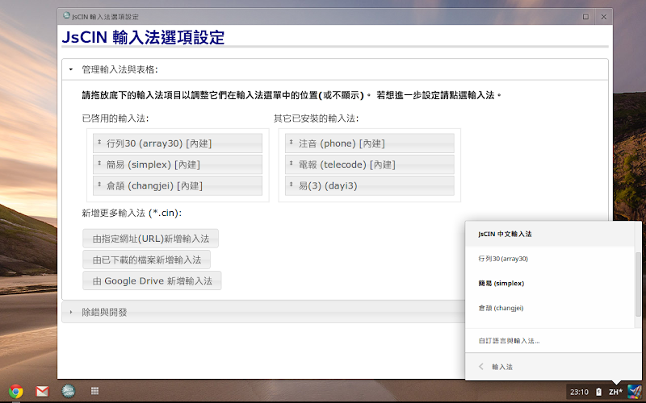
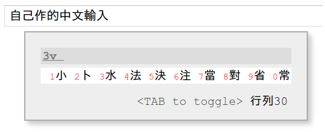

# How to install and use JsCIN

## ChromeOS (Chromebooks)
To install and activate the JsCIN input method environment on Chromebooks:

- Install the extension via [Chrome Web
  Store](https://chromewebstore.google.com/detail/jscin/cdkhibgadomdghgnknpmgegpjjmfecfk).
- Go to the Input settings (Settings, Device, Keyboards and Inputs, Input
  settings, Add input methods).
- Type to search for `JsCIN  Input Method`, select and Add.
- Switch your keyboard to `[ZH] JsCIN Input Methods` to start typing. \
  
- In the keyboard selection or extension page, you can find the 'Option'
  to load and select your favorite input method using your customized table. \
  

## Chrome Browser (non-Chromebooks)
The Chrome browser support is a "best effort". We do not recommend using it for
daily use. The "Google Input Tools" may be a better choice.

- Install the extension via [Chrome Web
  Store](https://chromewebstore.google.com/detail/jscin/cdkhibgadomdghgnknpmgegpjjmfecfk).
- Click the Puzzle icon (Chrome extensions) on the right-top corner,
  find the `[中] JsCIN: Javascrip base ...` and click the pin button to pin it.
- Click the [中] icon on the extensions bar, select Options to adjust and
  configure which input methods you want to use.
- Restart your browser or reload the page you need to enter text, click the
  input or text area element so it has the keyboard focus, then single-press
  (press down and release up) the "Shift" key. That should bring the emulation
  IME window for you. \
  
- Single-press again to turn off the IME window.
